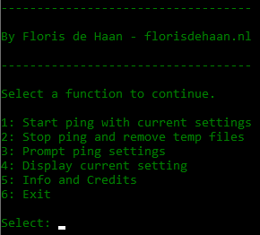
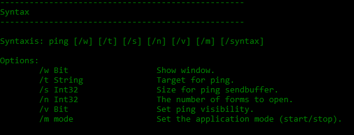

# ping-batch-prompt
Ping like a pro in windows using this simple batch script.

## Features
- Extending the windows ping
- Pinging in the background
- Easy to use prompt
- Checking target online status before starting
- Saving and reusing configurations
- Realtime status updates
- CLI interface

## Usage
### Prompt
Run the script directly or by cli to use the prompt.
````
start ping.bat
````


### Directly
You can also use the cli interface of the app. Please check the help menu by typing:
````
ping.bat /syntax
````


## About
Made some time ago (2012) when I had too much time to spare and wanted to experiment with batch scripts.
